## Packages

```{r}
#| echo: true

library(ggplot2)
library(deSolve) # for solving ODEs
theme_set(theme_bw()) #set ggplot theme
#use install.packages("Package") for any you don't have already


```

## Today

-   [**Machine learning decision model example (Cont.)**]{.underline}
-   Intro to Differential equations
-   Compartmental infectious disease models
-   System dynamics models
-   Choice of model type

## Today

-   [**Intro to Differential equations**]{.underline}
-   Compartmental infectious disease models
-   System dynamics models
-   Choice of model type

## Differential equation (DEQ) models

-   Used to model dynamic systems in physics, engineering, biology, ecology, epidemiology...

-   Describe system changes over time using equations that relate rates of change to current state of system

    -   Rate of change = derivative

-   Solved by integrating over time (exact solution) or using numerical methods (approximate solution)

## Types of DEQs

-   [Ordinary differential equation (**ODE**):]{.underline} function of one variable and its derivative

-   [System of differential equations:]{.underline} functions of \>1 variable and their derivatives

-   [Partial differential equations (**PDEs**)]{.underline}: functions variables and their partial derivatives

-   [Delay differential equations (**DDEs**)]{.underline}: include time delays

-   [Stochastic differential equations (**SDEs**):]{.underline} include random components to model uncertainty

    -   Or, use deterministic DEQs + PSA for uncertainty

## DEQs in health decision analysis

-   Typically used for **continuous time cohort modeling**

    -   **Variables:** health states (compartments)

    -   **Derivatives:** transition rates

-   Transitions depend on how cohort distributed across compartments

-   Common for modeling epidemics

    -   Rate of new infections proportional to number of infectious & susceptible people

-   Sometimes approximated with difference equations

## DEQ vs. discrete time CSTM

::::: columns
::: {.column width="50%"}
**Similarities**

-   Individual in one state (compartment) at a time

-   Individuals in state treated identically

-   Transition between states over time
:::

::: {.column width="50%"}
**Differences**

-   Continuous time

-   Transition can depend on

    -   Current status (or rate of change) of other compartments

    -   Other factors
:::
:::::


## Today

-   Intro to Differential equations
-   [**Compartmental infectious disease models**]{.underline}
-   System dynamics models
-   Choice of model type

## SIR model

Three states: [**S**]{.underline}usceptible, [**I**]{.underline}nfectious, [**R**]{.underline}emoved (recovered or dead)

Infection rate $\beta$ governs S $\rightarrow$ I

Removal rate $\mu$ governs S $\rightarrow$ R


## Differential equations for SIR

::::: columns
::: {.column width="40%"}
$$
\begin{aligned}
&\frac{dS}{dt}= -\beta S I\\
&\frac{dI}{dt} = \beta S I - \mu I\\
&\frac{dR}{dt} = \mu I
\end{aligned}
$$
:::

::: {.column width="60%"}
$$
\begin{aligned}
&S(t+m) = S(t) + \int_t^m -\beta S I dt\\
&I(t+m) = I(t) + \int_t^m (\beta S I - \mu I)dt\\
&R(t+m) = R(t) + \int_t^m \mu I dt
\end{aligned}
$$
:::
:::::


## SIR

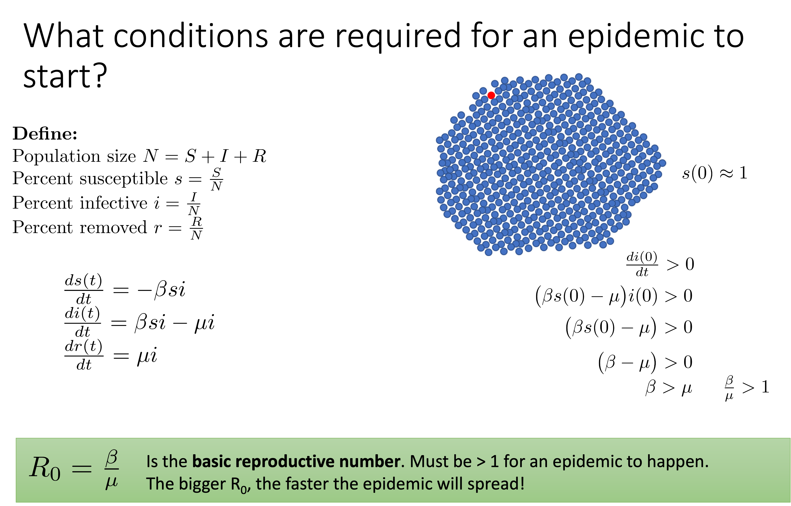

## Bigger R0 means bigger and shorter epidemic

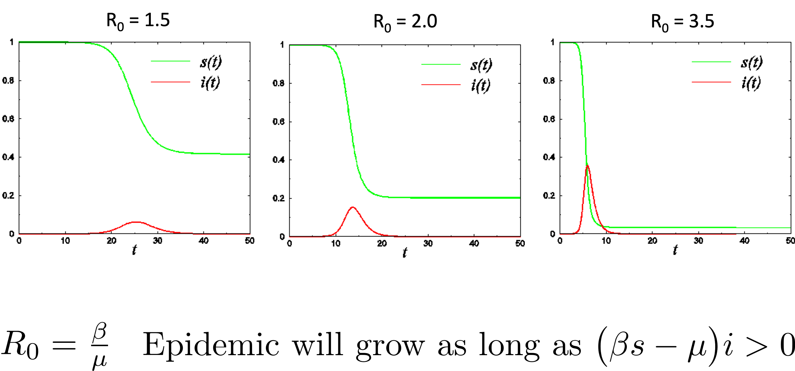

## Difference equations: a discrete approximation

::::: columns
::: {.column width="60%"}
$$
\begin{aligned}
&S(t+m) = S(t) + \int_t^m -\beta S I dt\\
&I(t+m) = I(t) + \int_t^m (\beta S I - \mu I)dt\\
&R(t+m) = R(t) + \int_t^m \mu I dt
\end{aligned}
$$
:::

::: {.column width="40%"}
$$
\begin{aligned}
&S_t = S_{t-1} -\beta^* S_{t-1} I_{t_1}\\
\\
&I_t = I_{t-1} + \beta^* S_{t-1} I_{t-1} - \mu^* I_{t-1}\\
\\
&R_t = R_{t-1} + \mu^* I_{t-1}
\end{aligned}
$$
:::
:::::

$\beta^*$ and $\mu^*$ are discrete analogs for $\beta$ and $\mu$. Values depends on the cycle length.

## Open cohorts models

-   While (Semi)Markov models usually closed, differential eqn models can be open

-   People enter (born, age in, get condition) and leave (die, age out)

-   Cohort size not conserved for open cohorts

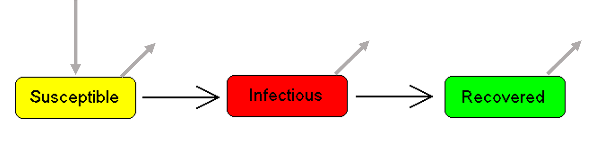

## Age-structuring

-   In (Semi-)Markov models, usually build separate models to capture age cohorts

-   For differential eqn model, may need to put age groups in same model for proper transition dynamics

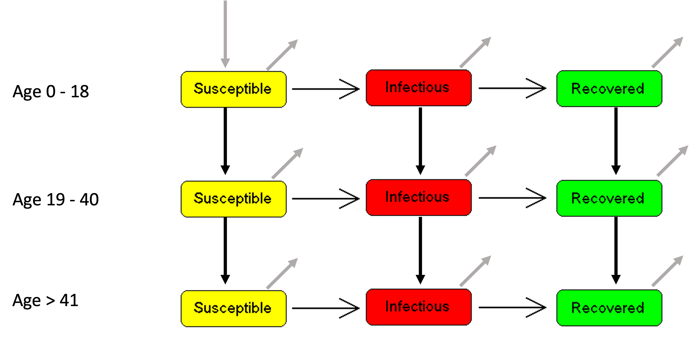

## SIR model in R

Paper: [Bjørnstad et. al. Nature Medicine 2020](https://doi.org/10.1038/s41592-020-0822-z)

Shiny app: <https://shiny.bcgsc.ca/posepi1/>

Code on github: <https://github.com/martinkrz/posepi1>

## ode() function in R package deSolve

Load `library(deSolve)` and type `?ode()` to view help file

## System of equations in R

<https://github.com/martinkrz/posepi1/blob/master/R/models.R>

```{r}
#| eval: false
#| echo: true

# sir_system() specifies system of eqns to solve within ode() function
#    t: time sequence vector (first entry must be initial time)
#    y: initial state of (S, I, R)
#    parms: named list of parameters (beta, mu, gamma, N)
sir_system=function(t, y, parms){
  S = x[1]
  I = x[2]
  R = x[3]
  beta  = parms["beta"]
  mu    = parms["mu"]
  gamma = parms["gamma"]
  N     = parms["N"]
  dS  = mu*(N-S)  - beta*S*I/N
  dI  = beta*S*I/N - I*(mu + gamma)
  dR  = gamma*I - mu*R
  res = c(dS,dI,dR)
  list(res)
}
```


## Calling system of equations

<https://github.com/martinkrz/posepi1/blob/master/R/models.R>

```{r}
#| eval: false
#| echo: true

# sir() is a wrapper function for ode() that specifies time sequence, 
#.    initial conditions, and parameters
sir = function(beta=3, gamma=2, vac=0, tmax=20, step=sir_system_time_step) {
  time  = seq(0, tmax, by=step)
  parms = c(mu=0, N=1, beta=beta, gamma=gamma)
  start = c(S=1-sir_init_i-vac, I=sir_init_i, R=0)
  out   = ode(y     = start, 
              times = time, 
              func  = sir_system, 
              parms = parms)
  out   = cbind(out,data.frame(R0=beta/gamma,vac=vac))
  return(as.data.frame(out))
}
```

## "Rewards" and DEQ models

-   Costs, QALYs calculated by integrating over time

-  Ex: if cost per unit time infectious = $c_I$, then total cost while infecitous is:
$$
\int_0^T c I(t) dt
$$

## DEQ resources

-   ["Exploring Modeling with Data and Differential Equations Using R" by John Zobits](https://jmzobitz.github.io/ModelingWithR/)

## Today

-   Intro to Differential equations
-   Compartmental infectious disease models
-   [**System dynamics models**]{.underline}
-   Choice of model type

## Credit

Much of this section based on

-   [System Dynamics Modeling with R](https://link-springer-com.proxy3.library.mcgill.ca/book/10.1007/978-3-319-34043-2) (2016) by Jim Duggan

## System dynamics philosophy

Actions can have consequences through complex, non-linear [**feedback loops**]{.underline}

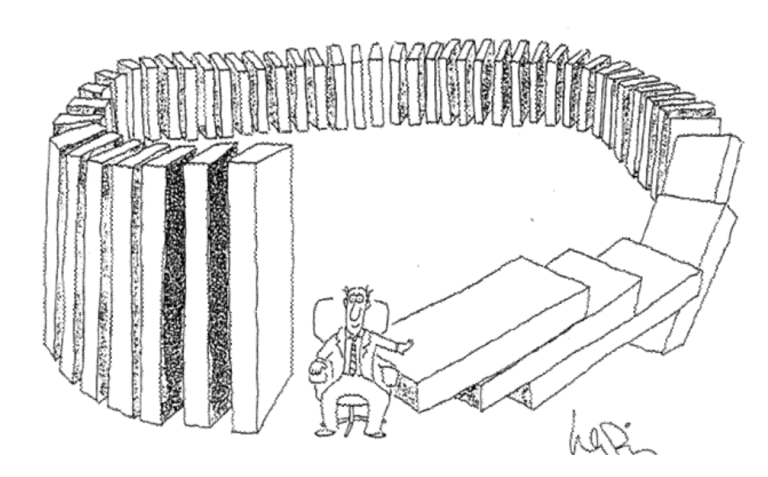

## Stocks and flows

-   Stocks = compartment/state

-   Flows = transitions

-   Analogy: faucet, bathtub, drain

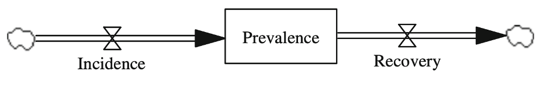

## More stocks and flows

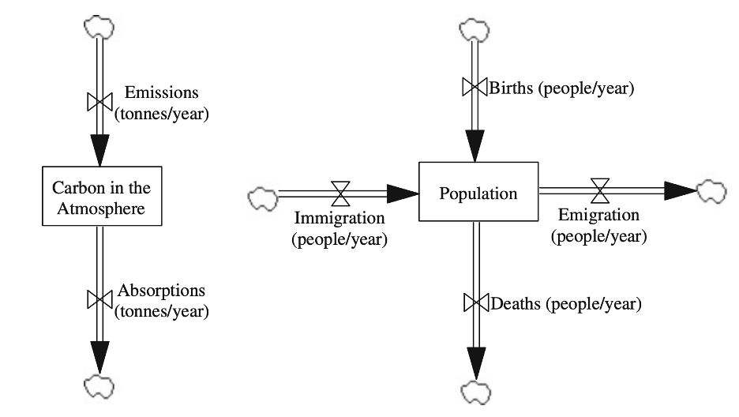

## Feedback loops

> A closed chain of causal connections from a stock—through a set of decisions, rules, physical laws, or actions—that are dependent on the level of the stock, and back again through a flow to change the stock -Meadows (2008)

-   Feedback loops distinguish SD models from typical DEQ

-   Two types of feedback loops:

    -   **Balancing:** negtaive feedback, "goal-seeking"

    -   **Reinforcing:** positive feedback, "run-away"

## Heating a room: balancing loop (negative feedback)

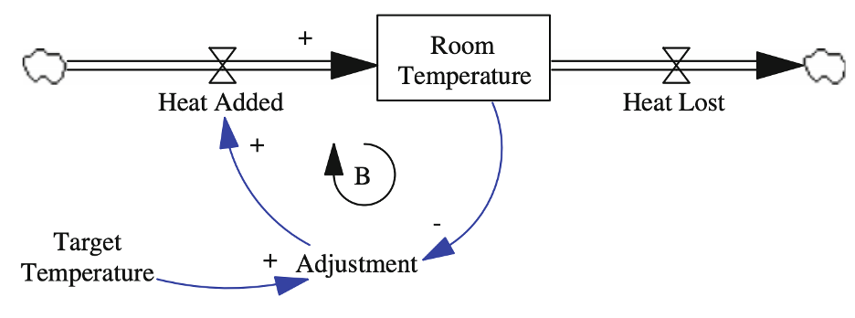

## Capital investment: reinforcing loop (positive feedback)

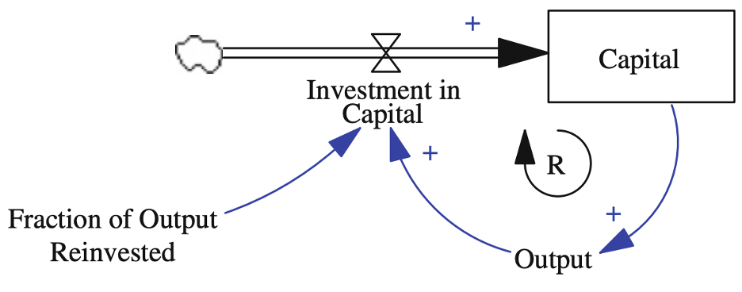

## Ex: Opioid misuse and use disorder

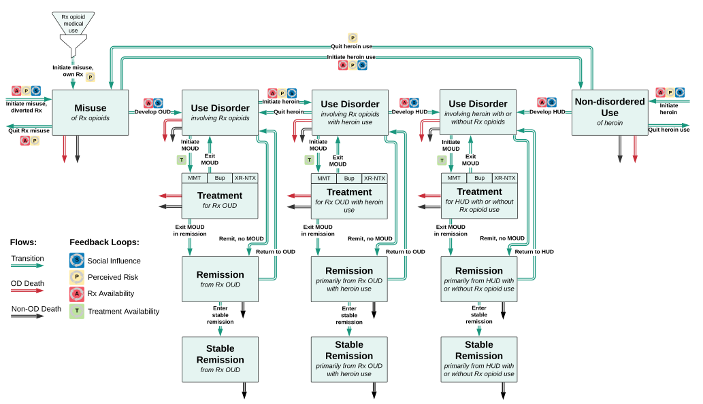

## Feedback loops in opioid example

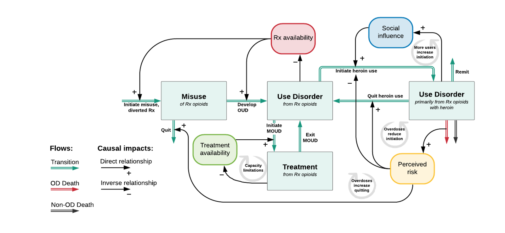

[Stringfellow et. al. 2022](https://pubmed.ncbi.nlm.nih.gov/35749492/)

[Lim et. al. 2022](www.doi.org/10.1073/pnas.2115714119)

## Resources for SD modeling

-   [Tracy et. al. 2018. "ABM in Public Health" Annual Review of Public Health](https://doi.org/10.1146/annurev-publhealth-040617-014317)

-   [SD in R intro](https://rpubs.com/rsmard05/sysDynR), Cpt. Rick Mard

-   [System Dynamics Modeling with R](https://link-springer-com.proxy3.library.mcgill.ca/book/10.1007/978-3-319-34043-2) by Jim Duggan

-   [Vensim software](https://vensim.com/free-download/)


## Limitations of SIR-type DEQ models

-   Assume homogeneous mixing of population

-   Cannot capture individual-level heterogeneity

-   Cannot capture history-dependence (e.g., waning immunity)

    -  Can approximate with more compartments

## Today

-   Intro to Differential equations
-   Compartmental infectious disease models
-   System dynamics models
-   [**Choice of model type**]{.underline}

## Choosing a model type

-   [**Goal:**]{.underline} capture relevant differences between strategies

-   "As complex as needed, as simple as possible."

-   Trade-offs

    -   Computational demand

    -   Analyzable outputs

    -   Types of error

    -   Transparency and interpretability

## Computational demand

-   Rarely a limiting factor for cohort models

    -   Discrete time CSTM, DEQ, decision trees

-   Often a challenge for individual simulations

    -   DES more efficient than individual state-transition microsimulation when most individuals do not transition most cycles

    -   Agent-based models usually the most demanding

## Error in decision modelling

-   [**Estimation error:**]{.underline} differences in quantity of interest between model output & real event generating process

-   [**Decision error:**]{.underline} making the wrong recommendation/decision based on model output

Poor estimation does not necessarily lead to the wrong decision

## Taxonomy of errors

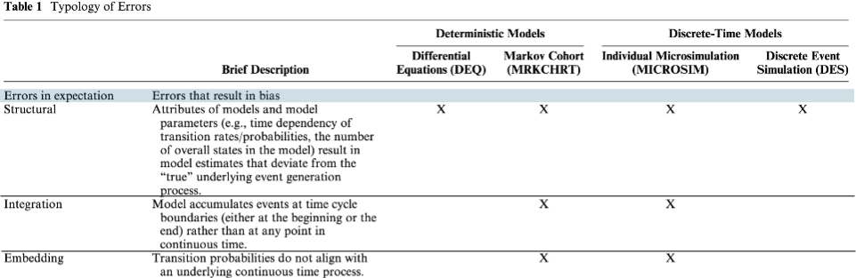

## Taxonomy of errors

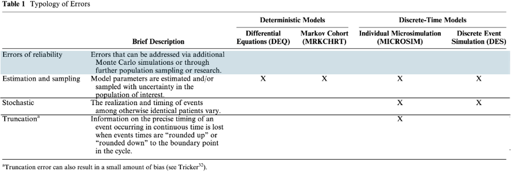

## Recall: Embedding error

-   Misalignment between transition probabilities and underlying continuous-time process

-   Occurs when:

    -   literature-based parameters are transformed and embedded using common rate-to-prob formala $P = 1 - e^{-rt}$

    -   Competing events (transitions to \>1 state possible)

Standard rate-to-prob ignores possiblity of two transitions in same cycle

## Discrete time embedding error example

-   $A$: untreated, $B$: on therapy, $C$: side effect from therapy

-   **In continuous time:** $A \rightarrow B \rightarrow C$ not possible

-   **In a discrete time model:** if $A \rightarrow B \rightarrow C$ can happen faster than your cycle length, individuals should be able to start a cycle in $A$ and end and $C$

## Solutions to embedding error

-   Model process in continuous time

    -   DEQ or Discrete event simulation

-   Specify a transition matrix consistent with a generator matrix of unverlying intensities (rates)

    -   Easier if transitions first estimated as rates in a transition intensity matrix

    -   See [Graves et. al. 2021 supplement](https://doi.org/10.1177/0272989X21995805) for details

## Jensen's inequality

For a function $f()$ and random variable $X$:

$$
E[f(X)] \neq f(E[X])
$$

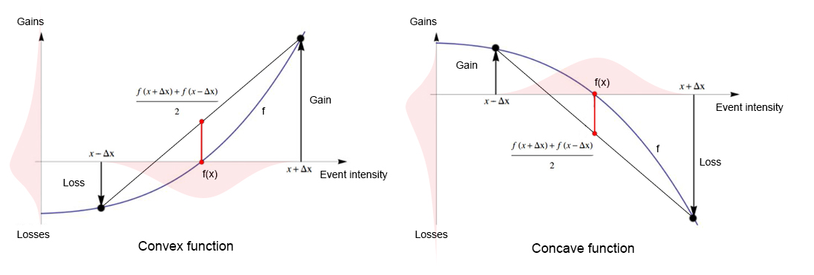
Source: [K Shanti Priya on Medium](https://medium.com/@k.shantipriya27/jensens-inequality-unveiling-its-power-in-data-science-and-machine-learning-ecf75cadf10f)

## Implications for modelling choice

For a model $f()$, individual parameters $X$, and model output $Y$:

$$
f(E[X]) \neq E[f(X)]
$$

-   Cohort model cannot perfectly estimate population mean outcomes $E[Y]$, even if population mean parameters $E[X]$ are precisely known

-   Absolute precision in $E[Y]$ only possible when distribution of parameters between individuals is modelled

## Choosing a model type

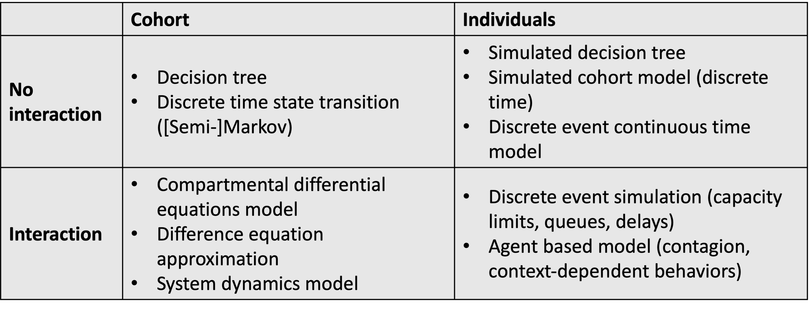

## Recap

-   Differential (difference) equation models useful when distribution of population across states influences transitions (e.g., infectious diseases)

-   System dynamics models useful for modeling feedback loops and complex systems

-   Choice of model type depends on trade-offs between computational demand, analyzable outputs, types of error, and transparency/interpretability

## Logistics

-   Complete reading before next class

-   **Project proposal** due Fri, Feb 27

-   **Assignment 4**

    -   Will be posted by Fri, Feb 20
    
    -   Due Wed, Mar 11

-   **Open source model presentations** in class on Thurs, March 12

-   **Office hours** on Mondays 2:30pm to 3:30pm, room 1128
