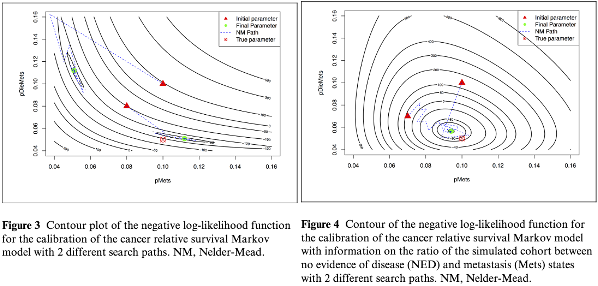

## R packages

```{r}
#| echo: true
library(ggplot2)
theme_set(theme_bw())

# calibration functionality
library(lhs)

# visualization
library(psych)
```

## Today

-   Wrapping up DEQ lecture

-   Model calibration

-   Model validation

## Wrapping up DEQ lecture

<https://htmlpreview.github.io/?https://github.com/altonrus/epib-678/blob/main/sessions/13-differential_equations/deq_models.html#/feedback-loops-in-opioid-example>

## Today

-   [**Model calibration**]{.underline}

    -   Concept

    -   Deterministic methods

    -   Bayesian methods

-   Model validation

## Models combine multiple sources of evidence


Modeled outcomes are complex functions of multiple parameters

## Model as a function


## Estimating parameter values

-   **Direct estimation:** with primary data or published studies

-   **Expert or data-informed estimation**: using imperfect or semi-applicable data and/or expert opinion, develop reasonable estimates/uncertainty ranges

-   **Calibration:** use data on model ***outcomes*** to estimate model ***inputs*** (parameters)

## Model as function 2


Calibration uses data on modeled outcomes to estimate model parameters (and sometimes model structure)

## Calibration

Using data on **outcomes** to estimate **parameters**


## Steps in model calibration

1.  Derive calibration targets from real-world data

2.  Structure model to produce analogous measures

3.  Identify model parameters to be calibrated

    -   Usually, just a subset

4.  Implement a calibration algorithm

    -   Ad hoc

    -   Optimization

    -   Bayesian or approximately Bayesian

## Hands on model calibration in R

[Guided tutorial by DARTH working group](https://darth-git.github.io/calibSMDM2018-materials/)

Eva Enns, Fernando Alarid-Escudero, and Caleb Easterly 2018

## Calibration task

::::: columns
::: {.column width="65%"}


[Alarid-Escudero et. al. 2018](https://doi.org/10.1177/0272989X18792283)
:::

::: {.column width="35%"}
Calibrate `p.Mets` and `p.DieMets` by fitting to observed survival data

**Abbreviations:** Mets, metastasis; NED, no evidence of diseases
:::
:::::

## Target data

```{r}
#| echo: true
load("CRSTargets.RData")
CRS.targets
```

## Plot target data

```{r}
#| echo: true
p_target <- ggplot(CRS.targets$Surv, aes(x=Time, y=value))+
  geom_point()+
  geom_errorbar(aes(ymin=lb, ymax =ub))+
  ylab("Pr Survive")
p_target

```

## Load and run model

```{r}
#| echo: true
source("markov_crs.R")
v.params.test <- c(p.Mets = 0.1, p.DieMets = 0.2)
model_result <- markov_crs(v.params.test)
head(model_result$Surv)
```

## Uncalibrated model vs. targets

```{r}
#| echo: true
t_compare <- cbind(CRS.targets$Surv,
                   output = model_result$Surv)
ggplot(t_compare, aes(x=Time, y=value))+
  geom_point()+geom_errorbar(aes(ymin=lb, ymax =ub))+
  geom_point(color="darkred", aes(y=output))+
  ylab("Pr Survive")
```

## Random search method

-   Specify parameter value range

-   Sample several sets (pairs) of parameters

-   Identify best-fitting set

    -   Minimize error/maximize goodness-of-fit

## Latin hypercube sampling

::::: columns
::: {.column width="52%"}


From [LHS basic vignette 2022](https://cran.r-project.org/web/packages/lhs/vignettes/lhs_basics.html)
:::

::: {.column width="48%"}
-   Using partitions to ensuring samples are well-dispersed across the parameter space

-   Lots of variants

-   Can use uniform random method then 'rescale' to fit our range or distribution
:::
:::::

## Code: latin hypercube sampling

```{r}
#| echo: true
set.seed(1010)
param.names <- c("p.Mets","p.DieMets")
n.param <- length(param.names)
rs.n.samp <- 3000
# lower bound
lb <- c(p.Mets = 0.04, p.DieMets = 0.04) 
# upper bound
ub <- c(p.Mets = 0.16, p.DieMets = 0.16)
# Sample unit Latin Hypercube (uniform random!)
m.lhs.unit <- lhs::randomLHS(rs.n.samp, n.param)
colnames(m.lhs.unit) <- param.names

```

## Plot LHS samples (for random search calibration)

```{r}
#| echo: true
ggplot(data=data.frame(m.lhs.unit), aes(x=p.Mets, y=p.DieMets))+geom_point()
```

## Rescale parameters

```{r}
#| echo: true
# Rescale to min/max of each parameter
rs.param.samp <- matrix(nrow=rs.n.samp,ncol=n.param)
colnames(rs.param.samp) <- param.names
for (i in 1:n.param){
  rs.param.samp[,i] <- qunif(m.lhs.unit[,i],
                           min = lb[i],
                           max = ub[i])
}
```

-   Could rescale to represent draws from other distributions using `qbeta()`, `qnorm()`, `qgamma()`, etc.

-   Could use the inverse CDF method for any non-standard distribution with defined CDF

## Distribution of LHS-sampled params

```{r}
#| echo: true
psych::pairs.panels(rs.param.samp)
```

## Likelihood function

-   Asks, how likely is the modeled output given the calibration data?

-   Higher likelihood $\rightarrow$ modeled output more consistent with calibration data

-   We'll use a normal distribution for likelihood

-   For numerical stability, we compute **log-likelihood**

## Why log-likelihood?

Calibration identifies parameters that maximize total likelihood, [the product of the likelihood]{.underline} of each target

$$
A: \underset{\Theta}{\operatorname{argmax}} p(\textbf{x} \mid \Theta ) = \underset{\Theta}{\operatorname{argmax}} \prod_{i=1}^N p(x_i \mid \Theta)
$$Equivalent to maximizing the [sum of the log-likelihoods]{.underline}

$$
B: \underset{\Theta}{\operatorname{argmax}} \ln p(\textbf{x} \mid \Theta ) = \underset{\Theta}{\operatorname{argmax}}\sum_{i=1}^N \ln p(x_i \mid \Theta)
$$

Floating point precision issues less likely with B than with A

## Goodness-of-fit function

```{r}
#| echo: true
gof_norm_loglike <- function(
    target_mean, #vector of mean for p(survive) by year (target)
    target_sd,  #vector of SD for p(survive) by year (target)
    model_output #vector of modeled p(survive) by year
    ){
  #Sum the log-likelihood of modeled output given target distribution
  sum(dnorm(x = model_output,
            mean = target_mean,
            sd = target_sd,
            log = TRUE))
}
```

Calculates the log-likelihood of your survival probabilities given a likelihood distribution fit to your target

## Random search: compute GOF for each parameter set

```{r}
#| echo: true

#vector to store log-likelihood (goodness of fit) for each 
#. parameter set we generated with latin hypercube sampling
rs.loglike <- rep(0, rs.n.samp) 

for (j in 1:rs.n.samp){
  #  Run model for a given parameter set
  model.res = markov_crs(v.params = rs.param.samp[j, ])
  # Calculate goodness-of-fit of model outputs to targets 
  # (log likelihood of the model output given the targets)
  rs.loglike[j] = gof_norm_loglike(model_output = model.res$Surv,
                               target_mean = CRS.targets$Surv$value,
                               target_sd = CRS.targets$Surv$se)
}

head(rs.loglike)
head(exp(rs.loglike)) # exponentiate to get likelihood


```

## Random search: best-fitting parameters

```{r}
# Arrange parameter sets in order of fit
rs.calib.res <- cbind(rs.param.samp, rs.loglike)
rs.calib.res <- rs.calib.res[order(-rs.calib.res[,"rs.loglike"]),]

# Examine the top 10 best-fitting sets
ggplot(data = data.frame(rs.calib.res), aes(x=p.Mets, y=p.DieMets, colour = exp(rs.loglike)))+
         geom_point()+scale_colour_gradient(low="skyblue",high="darkred")

rs_best_fit_params <- c(rs.calib.res[1, c("p.Mets",  "p.DieMets")])
```

Goodness-of-fit maximized when p.DieMets = `r rs_best_fit_params["p.Mets"]`, p.Mets = `r rs_best_fit_params["p.DieMets"]`

## Random search: calibrated model vs. target

```{r}
#| echo: true
rs_best_fit_params <- c(rs.calib.res[1, c("p.Mets",  "p.DieMets")])
rs_best_fit_model <- markov_crs(rs_best_fit_params)

t_compare <- cbind(CRS.targets$Surv,
                   random_search = rs_best_fit_model$Surv)
ggplot(t_compare, aes(x=Time, y=value))+
  geom_point()+geom_errorbar(aes(ymin=lb, ymax =ub))+
  geom_point(color="red", aes(y=random_search))+
  ylab("Pr Survive")
```

## Alternative goodness-of-fit measures

-   **Other likelihood distributions:** Beta, Dirichlet, gamma, etc.

-   **Distribution-free:** Absolute error, weighted sum of square error

Handling \>1 target

-   Judge parameter set based on combined measure, e.g., weighted sum where more "important" targets given higher weights

## Nelder-Mead calibration

-   Nelder-Mead is a directed search method for identifying a local minimum or maximum to a function

    -   Unlike random search which is undirected

-   Sample several starting points with goal of finding global optimum

## Local and global optima


Source: [Chao Jin 2015](http://dx.doi.org/10.13140/RG.2.2.32537.83041)

## NM calibration: sample starting values

```{r}
#| echo: true
n.init <- 100; n.param = 2
set.seed(101)
nm.params.init <- cbind(
  runif(n.init, min = lb[1], max = ub[1]),
  runif(n.init, min = lb[2], max = ub[2])) |>
  as.matrix()

dimnames(nm.params.init) <- list(NULL, param.names)

head(nm.params.init, 6)
```

## NM calibration: objective function

Same basic steps as random search, just put into a function that we can call within the optimizer

```{r}
#| echo: true
nm_objective = function(v.params){
  ###   Run model for parametr set "v.params"
  model.res = markov_crs(v.params)
  # log likelihood  
  v.GOF = gof_norm_loglike(target_mean = CRS.targets$Surv$value,
                              model_output = model.res$Surv,
                              target_sd = CRS.targets$Surv$se)
  return(v.GOF)
}

```

## NM calibration: run the calibration

**optim**: General-purpose optimization based on Nelder--Mead, quasi-Newton and conjugate-gradient algorithms.

```{r}
#| echo: true
nm.calib.res <- matrix(nrow = n.init, ncol = n.param+1)
colnames(nm.calib.res) <- c(param.names, "Overall_fit")
for (j in 1:n.init){
  
  fit.nm <- optim(nm.params.init[j,], nm_objective, 
                 control = list(fnscale = -1, #maximize instead of minimize
                                maxit = 1000), 
                 hessian = T)
  nm.calib.res[j,] <- c(fit.nm$par,fit.nm$value)
}

```

## NM calibration: results from 100 starting points

```{r}
#| echo: true
# Arrange parameter sets in order of fit
nm.calib.res <- nm.calib.res[order(-nm.calib.res[,"Overall_fit"]),]
# Examine the top 10 best-fitting sets
nm.calib.res[1:4,]

table(round(nm.calib.res[,1],digits=3))

```

## NM calibration: results from 100 starting points

```{r}
#| echo: true
ggplot(data=data.frame(nm.calib.res))+
  geom_point(aes(x=p.Mets, y=p.DieMets, overall_fit=Overall_fit))
```

## Compare NM and random search

```{r}
#| echo: true
#| eval: false
nm_best_fit_params <- c(nm.calib.res[1, c("p.Mets",  "p.DieMets")])
nm_best_fit_model <- markov_crs(nm_best_fit_params)

t_compare <- cbind(t_compare,
                   nelder_mead = nm_best_fit_model$Surv)

ggplot(t_compare, aes(x=Time, y=value))+
  geom_point()+
  geom_errorbar(aes(ymin=lb, ymax =ub))+
  geom_point(color="red", aes(y=random_search))+
  ylab("Pr Survive")+
  geom_point(color="green", alpha = 0.5, aes(y=nelder_mead))
```

## Compare NM and random search

Fit of NM (green) and random search (red) nearly identical in this case

```{r}
#| echo: false
nm_best_fit_params <- c(nm.calib.res[1, c("p.Mets",  "p.DieMets")])
nm_best_fit_model <- markov_crs(nm_best_fit_params)

t_compare <- cbind(t_compare,
                   nelder_mead = nm_best_fit_model$Surv)

ggplot(t_compare, aes(x=Time, y=value))+
  geom_point()+
  geom_errorbar(aes(ymin=lb, ymax =ub))+
  geom_point(color="red", aes(y=random_search))+
  ylab("Pr Survive")+
  geom_point(color="green", alpha = 0.5, aes(y=nelder_mead))
```

## Model nonidentifiability

When \>1 parameter sets can produce the same output

-   No unique model solution; one-to-many mapping between parameters & outputs

    -   In linear regression, occurs when predictors are not linearly independent (multicollinearity)

-   Identifiability is determined by parameters, model structure, and modelled outcomes

## Handling nonidentifiable calibration tasks

-   Parameters often nonidentifiable for a [**subset**]{.underline} of model outcomes

    -   In our model, `p.mets` and `p.diemets` are unidentifiable for outcome of overall survival over time

    -   Adding another target can make the calibration task identifiable

-   Identifiability not required for Bayesian calibration

    -   Multimodel posterior parameter sets are sometimes an honest reflection of our uncertainty

## Adding target to remove nonidentifiability

{width="4179"} Added target on Log-ratio NED/Mets ([Alarid-Escudero et. al. 2018](https://doi.org/10.1177/0272989X18792283))

## Further resource on nonidentifiability

[Semochkina and Walsh 2025. Incorporating Additional Evidence as Prior Information to Resolve Non-Identifiability in Bayesian Disease Model Calibration: A Tutorial](http://www.doi.org/10.1002/sim.70039)

Specific to Bayesian calibration, uses a DEQ epidemic model example

## What about uncertainty?

-   **Deterministic:** "What's the best-fitting parameter set?" (random search and NM)

-   **Probabilistic:** "What [distribution]{.underline} of parameters is [consistent with the uncertainty distribution]{.underline} of my calibration targets"

-   **Bayesian calibration** allows us to also use data on both parameters and outcomes to estimate parameters

    -   Can quantify uncertainty even when parameters are non-identifiable!

## Bayesian updating


## Bayesian calibration


## Bayesian calibration ins and outs


## Sample importance resampling (SIR) method


## Sample importance resampling (SIR) method


## Sample importance resampling (SIR) method


## Sample importance resampling (SIR) method


## Alternatives to SIR calibration

Incremental-mixture importance sampling ([Raftery et. al. 2010](https://doi.org/10.1111/j.1541-0420.2010.01399.x), [Menzies et. al. 2017](https://doi.org/10.1007/s40273-017-0494-4))

-   More efficient than SIR and fully Bayesian

Approximate bayesian computation ([Shewmaker et. al. 2022](https://doi.org/10.1177/0272989X221085569))

-   Use target ranges instead of likelihood

Incremental mixture approximate Bayesian computation ([Rutter et. al. 2019](doi.org/10.1214/19-AOAS1279))

RobustCalibration R package with GaSP emulator ([Gu 2022](https://doi.org/10.48550/arXiv.2201.01476))

## Bayesian calibration tutorial

Let's take a quick look at the [Bayesian tutorial by Enns et. al](https://darth-git.github.io/calibSMDM2018-materials/tutorials/imis_3state.html).

## Challenges in Bayesian calibration

-   Running many (sometimes millions) of parameter sets computationally challenging

    -   Can often simplify model to only compute targets

    -   Can develop metamodels (emulators) that approximate full model but run much faster

-   Prior specification

    -   Overly wide: wasted compute

    -   Overly narrow: risk of missing good-fitting parameter sets

    -   Analyze prior vs. posterior plots to assess if priors seem overly restrictive, or could be narrowed in future iterations

## Metamodel for calibration

 From [Pi et. al. 2026, DESCIPHR cancer modelling framework with DES and Bayesian calibration](https://doi.org/10.1007/s40273-025-01571-3)

## Ex: Prior and posterior plots


Source: [McNally et. al. 2026 CMAJ](https://doi.org/10.1503/cmaj.250591)

## Recap of calibration

-   Calibration identifies parameter values that produce modeled outcomes consistent with target data

-   Deterministic methods identify best-fitting point estimates

-   (Approximately) bayesian methods can approximate parameter draws over joint distribution of all parameters

    -   Needed to vary uncertain calibrated parameters in probabilistic sensitivity analysis!

## Today

-   Model calibration

-   [**Model validation**]{.underline}

## Model credibility

-   **Transparency:** analysis framing, structure, parameters, assumptions, limitations are documented and justified

-   **Validation**: model outputs reflect reality

## Model repurposing

-   Some models developed as multipurpose from start

    -   Oncosim (Canada) or MISCAN (USA)

-   Other models adapted after-the-fact to new decision problem

-   Must consider how decision-relevant trade-offs differ from original use case

    -   Simplifying assumptions that are OK for case 1 might be problem for case 2!

    -   Models can have different level of validity for different applications

## Types of validity

-   Face validity

-   Verification (internal validity)

-   Cross validity

-   External validity

-   Predictive validity

Eddy et. al. 2012 [Model transparency and validation report by ISPOR-SMDM Modeling Good Research Practices Task Force](doi.org/10.1177/0272989X12454579)

## Face validity

-   Inputs and assumptions reflect current evidence as judged by experts (e.g., clinicians, policy makers)

    -   Model structure

    -   Data sources

    -   Problem formulation (e.g., alternatives)

    -   Model output

-   Subjective and challenging

## Face validity best practice

> Validation should include an evaluation of face validity of a model's structure, evidence, problem formulation, and results. A description of the process used to evaluate face validity should be made available on request. To the greatest extent possible, evaluation of face validity should be made by people who have expertise in the problem area but are impartial and preferably blinded to the results of the analysis. If face validation raises questions, these issues should be discussed in the report.

## Verification

-   also called "internal" or "technical" validity

-   Are the calculations all correct?

-   Enhance through

    -   Code documentation

    -   Double programming

    -   'Trace analysis' (e.g., Markov cohort trace

    -   If I set parameters to extreme values or do 1- or 2-way sensitivity analyses, do outputs change in the direction I expect?

## Verification best practice

> Models should be subjected to rigorous verification. The methods should be described in the model's nontechnical documentation. Pertinent results of verification should be made available on request.

## Cross validation

-   Performance consistent with related models
    -   Same decision problem
    -   Same biological/social phenomena
-   If \>1 modelers reach same conclusion independently, trust in conclusions higher
-   More meaningful when models compared have different creators, data, methods

## Cross validation best practice

> Modelers should search for modeling analyses of the same or similar problems and discuss insights gained from similarities and differences in results.

## External validation

-   Consistency with real-world data (clinical trials, epi studies)

    -   Usually only possible for some aspects of model

        -   Disease progression, treatment efficacy, population distribution, etc.

-   Steps

    -   Identify data sources for validation

    -   Generate comparable measures from model

    -   Compare

## Data for external validation

-   **Sources:** Population statistics, epidemiological studies, surveys, clinical trials, claims data, electronic health records

-   ***Independent*** external validation (gold standard) uses data that was not considered in model development or calibration

-   Ideally, validation plan developed before any modeled results generated to avoid cherry picking

## External validation best practice 1

> Formal process that includes:
>
> Systematic identification of
>
> -   Suitable data sources
>
> -   Justification of the selection
>
> -   Specification of whether a data source is dependent, partially dependent, or independent
>
> -   Description of which model parts are evaluated by each source
>
> Simulation of each source

## Best practice 1 continued

> Comparison of results, including descriptions of
>
> -   Data source
>
> -   Simulation setup
>
> -   Discrepancies between source and simulation and their implications
>
> -   Discrepancies between simulation and observed results
>
> -   Sensitivity analyses
>
> Quantitative measures of how well the model's results match the source outcomes

## External validation best practice 2 & 3

> Modelers should make available on request a description of the external validation process and results, identify model parts that cannot be validated given lack of suitable sources, and describe how uncertainty about those parts was addressed.

> For multiapplication models, modelers should describe criteria for determining when validations should be repeated and/or expanded.

## Predictive validation best practice

Only applies to models predicting into the future.

> When feasible with respect to the decision being addressed and a future source's availability, a model should be tested for its prediction of future events. Builders of multiple-use models should seek opportunities to conduct predictive validations.

## Calibration vs. external validation plots

-   Look almost identical!

-   Difference is:

    -   Calibration plots compare modeled output to [**targets**]{.underline} (used to fit the model)

    -   Validation plots compare modeled output to [**external data**]{.underline} (ideally, data that was not considered in model development)

## Calibration validation trade-off

-   Must decide whether to use data for calibration or validation

    -   To maximize fit to data, use all available data to calibrate

    -   To maximize confidence that model reflects reality without being overfit, use available data for external validation

-   Case-by-case decision that depends what data are available

## Recap of validation

-   Aim to maximize confidence in analysis by clear and transparent face validity, verification, cross validity and external validation

-   External validation is great when feasible but depends on context

    -   If we use the best data to parameterize/calibrate, what's left for external validation?

## Logistics

-   Complete reading before next class

-   **Project proposal** due Fri, Feb 27

-   **Assignment 4**

    -   Posted Fri, Feb 20

    -   Due Wed, Mar 11

-   **Open source model presentations** in class on Thurs, March 12

-   **Office hours** on Mondays 2:30pm to 3:30pm, room 1128
